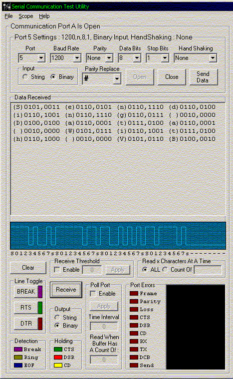



## Serial Com Port Utility

### Description

(Post hack Re-Submit)

This is a serial port communication utility that allows the control

of the properties of the MSComm object. It includes a simulated oscilloscope

display of the data waveform received by the port. It is still in its development

stage and is not very robust code as the project was just somethng I threw

together to check the communication to a PLC, but our engineeers wanted

more. I am looking for input from other programmers as to there likes and

dislikes so any input would be greatly appreciated. I submitted this before

but was "hacked" by some useless person.
 
### More Info
 

             |
---                |---
**Submitted On**   |2002-06-03 22:53:46
**By**             |[Tom DeWitt](https://github.com/Planet-Source-Code/PSCIndex/blob/master/ByAuthor/tom-dewitt.md)
**Level**          |Intermediate
**User Rating**    |4.8 (114 globes from 24 users)
**Compatibility**  |VB 6\.0
**Category**       |[Complete Applications](https://github.com/Planet-Source-Code/PSCIndex/blob/master/ByCategory/complete-applications__1-27.md)
**World**          |[Visual Basic](https://github.com/Planet-Source-Code/PSCIndex/blob/master/ByWorld/visual-basic.md)
**Archive File**   |[Serial\_Com89829642002\.zip](https://github.com/Planet-Source-Code/tom-dewitt-serial-com-port-utility__1-35458/archive/master.zip)

